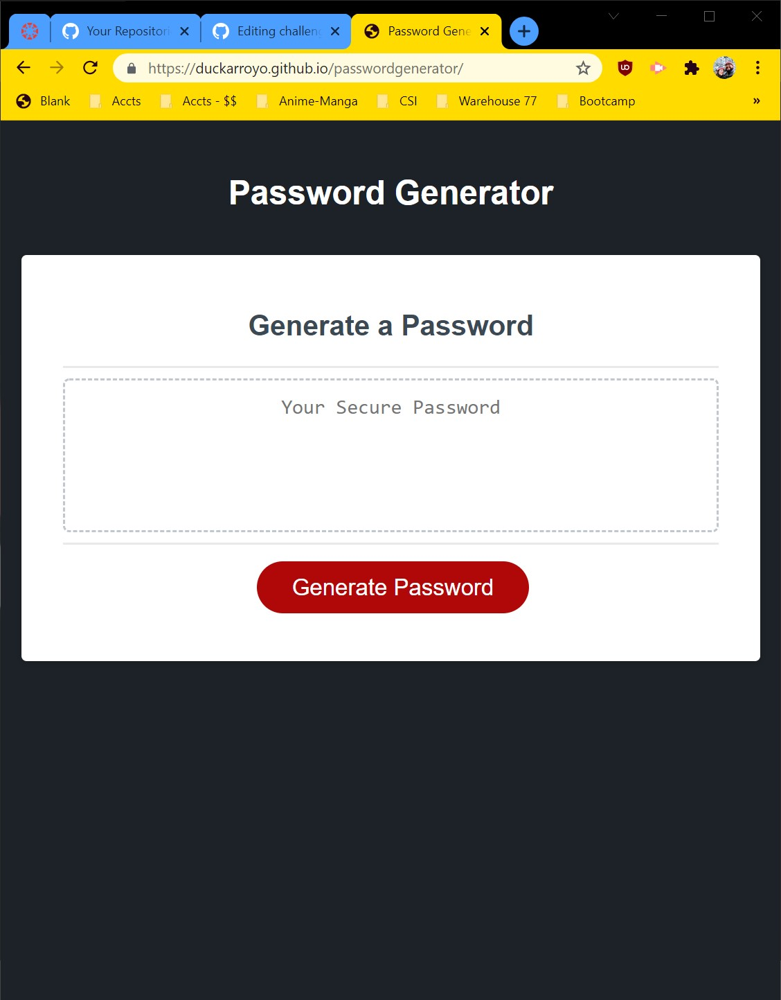

# Password Generator

## UO Coding bootcamp Challenge 3

## Description

Randomized password generator

## Links

[Github Pages](https://duckarroyo.github.io/passwordGenerator/)

[Github Repository](https://github.com/DuckArroyo/passwordGenerator)

[Heroku]()

## Required installations for code duplication

npm - npm install

.env - npm install dotenv

bcrypt - npm install bcrypt

Connect-session-sequelize - npm i connect-session-sequelize

Express Handlebars - npm install express-handlebars

Express-sessions - npm i express-session

express - npm install express

fs - npm install file-system --save

inquirer - npm install inquirer

Mongoose - npm install mongoose

mysql2 - npm install mysql2

sequelize - npm install sequelize

## The commandments

"scripts": {
"watch": "nodemon server.js",
"test": "jest",
"start": "node server.js",
"seed": "node seeds/index.js"
},

# Contributions by:

DeveloperDuckArroyo

[Email](mailto:DeveloperDuckArroyo@gmail.com)

[Portfolio](https://github.com/DuckArroyo/portfolio)

[React Portfolio](http://DuckArroyo.github.io/reactPortfolio)

[GitHub](https://github.com/DuckArroyo)

[Twitter @DevDuckArroyo](https://twitter.com/DevDuckArroyo)

[LinkeIn](https://www.linkedin.com/in/duckarroyo)

[CodePen](https://codepen.io/DeveloperDuckArroyo)

# Screnshots

